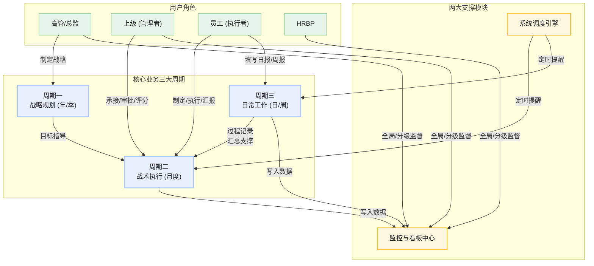

好的，遵照您的指示，我将不再使用看板（Canvas），直接在对话框中为您生成完整的Markdown格式PRD文档。

---

# PRD: 目标与工作管理系统 (V3.0)

> **文档状态:** 草稿
> **创建日期:** 2025-06-12
> **最后更新:** 2025-06-12
> **负责人:** [填写您的名字]

---

## **文档修订记录**

| 版本号 | 修订日期 | 修订人 | 修订内容 |
| :--- | :--- | :--- | :--- |
| V1.0 | [日期] | [姓名] | 初稿创建 |
| V2.0 | [日期] | [姓名] | 增加了自动化提醒、目标执行看板等流程 |
| V3.0 | 2025-06-12 | [姓名] | 增加了模板知识库、目标导航查询、未完成指标看板、灵活权限配置及详细模板字段等需求，并形成完整PRD |

---

## **1. 引言**

### **1.1. 项目背景**

当前公司在目标管理和日常工作汇报方面存在流程不统一、信息不同步、战略与执行脱节等问题。员工耗费大量时间在重复性的汇报工作上，而管理者难以高效获取团队进展，高层也无法直观洞察战略目标的执行健康度。为解决这些痛点，提升组织协同效率，特规划开发本“目标与工作管理系统”。

### **1.2. 产品目标**

* **近期目标:** 实现目标制定、日常工作记录、周期性汇报、自动化提醒与数据看板的核心功能，统一全公司的目标管理与工作协同流程。
* **中期目标:** 深度融合业务，通过数据分析为管理决策提供支持，提升组织绩效。
* **远期目标:** 构建公司级的知识沉淀与人才发展数据平台。

### **1.3. 核心价值**

* **对员工:** 明确目标，简化汇报，工作价值显性化。
* **对管理者:** 实时掌握进展，高效反馈指导，决策有数据支撑。
* **对公司:** 确保战略落地，提升组织效率，沉淀管理知识。

---

## **2. 用户角色与特征**

> **说明:** 以下角色与权限是根据通用实践提供的参考示例。系统后台应支持管理员进行灵活的角色定义与权限配置，以适应公司组织架构和管理模式的调整。

| 角色 | 特征描述 | 核心诉求 |
| :--- | :--- | :--- |
| **高管** | 公司战略决策者，关注宏观方向与结果。 | 快速了解公司战略执行健康度；确保目标有效传导。 |
| **HRBP** | 公司制度的推动者与监督者，关注流程合规与组织效率。 | 监控全员流程执行情况；获取数据以便进行组织分析和干预。 |
| **部门总监/事业部负责人** | 承上启下的核心管理者，关注部门目标达成与跨部门协作。 | 有效承接上级战略；管理团队目标；掌握下属绩效。 |
| **上级 (管理者)** | 一线团队的领导者，关注团队任务执行与成员状态。 | 敏捷掌握团队日常进展；高效进行月度复盘与反馈。 |
| **员工 (执行者)** | 任务的具体执行者，关注个人任务与成长。 | 清晰了解自己的目标；便捷地记录和汇报工作；获得及时的反馈。 |

---

## **3. 产品整体流程**

本系统通过三大业务周期与两大支撑模块协同运作，实现从战略到执行的闭环管理。

---

## **4. 功能需求详述 (Functionalities)**

### **4.1. 模块一：目标制定与规划 (Goal Setting & Planning)**

#### **4.1.1. 战略规划 (年/季)**

* **需求描述:** 支持高层管理者制定并发布公司/事业部长周期战略目标。
* **用户故事:** 作为CEO，我希望能在一个地方设定本年度最重要的三个战略目标，并让所有部门负责人看到，以便他们制定各自的承接计划。
* **功能点:**
    * **目标创建:** 提供“年度/季度战略模板”，支持创建包含战略意图、目标(O)、关键结果(KR)等字段的目标。
    * **目标对齐:** 下级目标（如事业部级）在创建时，必须关联一个上级目标（公司级），系统自动形成层级对齐关系。
    * **目标发布:** 目标创建后可设为“草稿”状态，确认无误后可“发布”，发布后全公司相关人员可见。

#### **4.1.2. 战术规划 (月度)**

* **需求描述:** 支持各级员工承接上级目标，制定并提交月度工作计划。
* **用户故事:** 作为一名开发工程师，我希望在月初能看到我们部门本月的重点目标，并据此填写我自己的月度计划，然后提交给我的直属领导审批。
* **功能点:**
    * **计划制定:** 提供标准的“月度计划/总结模板”。该模板包含以下可配置字段：`序号`、`权重`、`项目`、`内容`、`目标`、`考核标准`、`责任人`、`计划完成时间（开始--结束时间段）`、`实施措施`、`完成结果`、`未完成原因`、`上级评分`。员工在月初填写计划部分（如项目、目标、实施措施等）。
    * **上级目标透出:** 在填写月度计划页面，需清晰展示其直属上级已确定的月/季度目标，以供参考。
    * **审批流程:** 提交后，上级会收到审批提醒。上级可进行“批准”、“驳回（附带意见）”、“修改后批准”等操作。

### **4.2. 模块二：日常工作执行与记录 (Daily Work Execution & Logging)**

#### **4.2.1. 日报/周报填写**

* **需求描述:** 支持员工便捷地记录每日工作，并高效地汇总成周报。
* **用户故事:** 我每天都很忙，不希望花太多时间写日报。我希望能用最快的方式记下今天做了什么，并在周五时，系统能帮我把这些内容整理好，我简单修改一下就能提交周报。
* **功能点:**
    * **日报模板:** 提供极简的日报模板（今日完成/遇到问题/明日计划）。
    * **智能汇总:** 创建周报时，系统自动将本周所有日报的“今日完成”内容聚合到一个编辑区，供用户整理。
    * **工作项关联:** 在填写日报或周报时，可通过`#`或`@`功能，快速将一条记录关联到自己的月度目标上。

### **4.3. 模块三：模板中心与知识库 (Template Center & Knowledge Base) - `新增`**

#### **4.3.1. 模板库管理**

* **需求描述:** 支持管理员（如HR）集中创建和管理日、周、月、年等各类报告和计划的官方标准模板。
* **用户故事:** 作为HR，我希望统一公司的工作汇报标准，因此我需要一个后台功能，可以在里面创建好标准的月度总结模板，并设定为全员默认使用。
* **功能点:**
    * **模板创建/编辑:** 授权管理员可自定义模板的字段、布局和填写说明。系统需预置一套标准的“月度计划/总结模板”，其字段包括：`序号`、`权重`、`项目`、`内容`、`目标`、`考核标准`、`责任人`、`计划完成时间（开始--结束时间段）`、`实施措施`、`完成结果`、`未完成原因`、`上级评分`。
    * **版本控制:** 模板的修改需有版本记录，管理员可随时回滚到历史版本。
    * **权限与范围设置:** 可设定模板的适用范围（如全公司、某部门专用）和默认状态。

#### **4.3.2. 知识库与引用**

* **需求描述:** 为员工（尤其是新人）提供一个官方的模板库，他们可以随时查看、学习和引用标准模板。
* **用户故事:** 我是新来的员工，不清楚周报该怎么写。我希望能在一个地方找到公司推荐的标准周报模板和填写范例，最好能一键引用这个格式。
* **功能点:**
    * **模板广场:** 一个展示所有可用标准模板的页面，包含模板名称、适用场景、更新日期和预览。
    * **范例与说明:** 每个模板可附带详细的“填写指南”和1-2个“优秀范例”，帮助员工理解。
    * **一键引用:** 用户在创建自己的计划或报告时，可以选择“从模板库引用”，系统将自动加载所选模板的格式。

### **4.4. 模块四：查询与复盘 (Query & Review)**

#### **4.4.1. 目标导航查询页 (Goal Navigation & Query Page) - `新增`**

* **需求描述:** 提供一个统一的、多维度的查询入口，方便用户快速查找和回顾不同周期的目标与汇报内容。
* **用户故事:** 作为部门总监，我想快速回顾一下去年Q3我们部门的关键目标以及最终的完成情况，而不是在一堆零散的文档里翻找。
* **功能点:**
    * **导航筛选器:** 页面顶部提供“组织/人员范围选择器”和“时间维度筛选器（年/季/月/周）”。
    * **动态内容展示:** 根据筛选条件，主区域动态展示对应的目标列表和汇报内容。
        * 选择“年”，展示该年度的公司/部门战略目标。
        * 选择“季”，展示该季度的重点目标及各月度总结摘要。
        * 选择“月”，展示该月的详细计划、总结、评分及关联的周报列表。
        * 选择“周”，展示该周的详细周报内容。
    * **历史数据可访问:** 支持查询过往任意年份的数据。

#### **4.4.2. 月度复盘与评分**

* **需求描述:** 支持上级对下属的月度工作进行正式的复盘和评分。
* **功能点:**
    * **复盘视图:** 上级在审阅下属月度总结时，可在同一视图下看到员工月初填写的计划部分（目标、措施等）和月末填写的总结部分（完成结果、未完成原因）。
    * **评分与反馈:** 上级可根据“考核标准”对该周期的表现进行打分，并在“上级评分”和评语区填写反馈意见。
    * **结果归档:** 评分和评语将与月度总结一同归档，形成完整的绩效记录。

### **4.5. 模块五：监控与支持 (Monitoring & Support)**

#### **4.5.1. 系统自动化提醒**

* **需求描述:** 在关键时间节点，通过钉钉等工具自动提醒相关人员完成任务。
* **功能点:**
    * **提交提醒:** 在日报、周报、月报的截止时间前，自动提醒未提交的员工。
    * **审批/评分提醒:** 在提交后的一段时间内，自动提醒未处理审批或评分任务的管理者。
    * 提醒规则需在后台可配置。

#### **4.5.2. 目标执行看板**

* **需求描述:** 为HR和高管提供全局的流程执行监控视图。
* **功能点:**
    * **填报状态仪表盘:** 以组织架构树形式，实时展示各部门、各员工的报告提交状态（已提交/未提交/迟交）。
    * **考核进度仪表盘:** 展示各管理者的评分任务完成状态。
    * **数据导出:** 支持一键导出“未完成”名单，便于线下跟进。

#### **4.5.3. 未完成指标看板 (Uncompleted Metrics Dashboard) - `新增`**

* **需求描述:** 除了个人提醒外，为中高层管理者提供一个专门的看板，用于查看和分析其管辖范围内未完成的目标或指标。
* **用户故事:** 作为事业部负责人，我不仅想知道谁没完成，更想知道哪些类型的目标普遍完成度不高，以便分析是目标设定的问题还是资源支持的问题。
* **功能点:**
    * **列表视图:** 清晰列出在当前或已结束周期内，所有状态为“未完成”或“有风险”的关键目标（KR）。信息包括：目标内容、负责人、所属部门、计划完成时间、当前进度。
    * **聚合分析:** 提供简单的统计图表，如“各部门未完成指标数量分布”、“未完成原因分类统计”（需在月度总结中增加“未完成原因”分类选项）。
    * **跟进与支持:** 管理者可在此看板上直接`@`相关负责人，或标记某个指标为“需重点支持”，触发讨论或资源协调流程。

---

## **5. 非功能性需求**

| 类别 | 需求描述 |
| :--- | :--- |
| **性能需求** | 页面加载时间应小于3秒；复杂查询（如跨年度报表）响应时间应小于5秒。 |
| **兼容性需求** | 支持主流浏览器（Chrome, Firefox, Safari, Edge）的最新两个版本；具备良好的移动端Web访问体验。 |
| **安全性需求** | 用户数据严格隔离，确保用户只能访问其权限范围内的数据；所有关键操作需留有审计日志。 |
| **可用性需求** | 界面设计简洁、直观，核心操作路径不超过3步；关键功能需提供引导提示。 |

---

## **6. 名词解释**

| 术语 | 解释 |
| :--- | :--- |
| **O (Objective)** | 目标，指一个定性的、鼓舞人心的方向性描述。 |
| **KR (Key Result)** | 关键结果，指定量化的、可衡量目标达成与否的指标。 |
| **混合驱动模型** | 指战略目标自上而下分解，日常工作自下而上记录，并在系统中进行关联的管理模式。 |
| **目标地图** | 一种可视化的视图，用于展示各层级、各部门目标之间的对齐和关联关系。 |